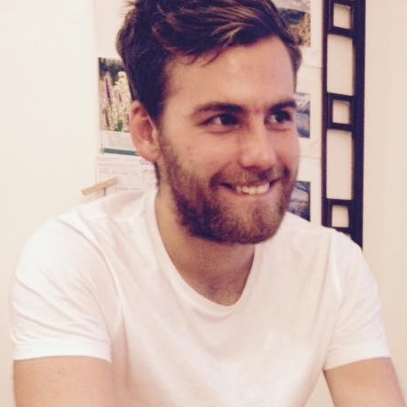

  
  

I'm a full-stack developer able to build web applications from scratch. I love solving complex problems in innovative ways. I want to use my skills to make the world a better place.

I first picked up coding during my Biomedical Sciences degree studying bioinformatics, and have been addicted to making cool things that people can use ever since.

  

# Skills and Languages

Most of my skills are centered around web development and a bit of data science:

**Python**  
Django, Pandas

**Devops**  
Docker, AWS, continuous integration and deployment

**JavaScript**  
React, Webpack, Node

**HTML**, **CSS** and **Sass**

**Bash**  
Shell scripting and tooling

**Other skills/ideologies**  
Test driven development  
Event sourcing and CQRS  
Hexagonal architecture  
Domain driven design  

This blog is built using [Hugo](https://gohugo.io/)
