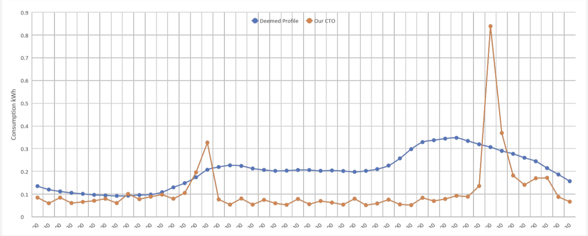

Smartmeters are great. They save you having to give your energy supplier readings every month and they
have flashy screens where you can see your usage in real time, in 30 minute intervals. It doesn't seem
like much now, but using this new technology and data can unlock a whole new way to use the energy 
system.

## Why is half hourly data better than monthly readings?

When you provide a reading your supplier every month, then you're being settled by what we call 'non
half hourly settlement'. You just pay the number of units you used that month multipled by the 'unit
rate', which is flat. However, when we send your reading to the industry, they use a 'profile' to
split the electricity you used that month into 30 minute periods, based on when they *expect* you
used your energy. We have to pay the wholesale rate for that half hourly period, which is based on
supply and demmand so we have to figure out what to charge you to encorporate this risk.

The table above shows the estimated industry profile (blue) and actual half hourly usage (orange) of
our CTO. As you can see, his usage doesn't match with what the industry expect he would, so there's a
mismatch in costs and we're having to pass more of the cost onto you the customer.

Smartmeters can record and send half hourly data to a central agency (called the DCC) and the energy
suppliers can obtain permissions to receive it. Most don't really do anything with it, but
some, like Octopus, are starting to do powerful things. For people who can shift their energy usage
outside of the peak periods (7-8am, 4-7pm) we can actually elect to send usage data to the
industry so they know exactly when you used it, meaning we can buy your energy at a cheaper rate. At
Octopus, we even pass that value on to you if you sign up to our [Agile tariff](https://octopus.energy/agile/).

## Putting a price on energy

The Agile tariff allows us to adjust the unit rate of your tariff on a 30 minute basis, providing
financial reasons to shift your energy usage to less busy periods of the day. Smart home tech improves
this further, allowing you to do your washing overnight or turn your heating on and off remotely.

If you have a means of generating or storing energy, either through solar panels, batteries or
even [your own car](https://www.octopusev.com/powerloop), you don't have to just use energy, you can
sell it back to the grid. This democratises and decentralises the grid to the point where entrapreneurial
people can actually live in a carbon neutral and cost neutal way!

## The future

Smartmeters already bring great value into our homes and give us an insight into how we use energy,
but there is plenty more we can do in the future.

There's a big industry project coming which effectively mandates half hourly settlement for domestic
customers. It will likely goes live in a couple of years, but it's heavily reliant on the smart
meter rollout. It marks a new age in energy consumption.
