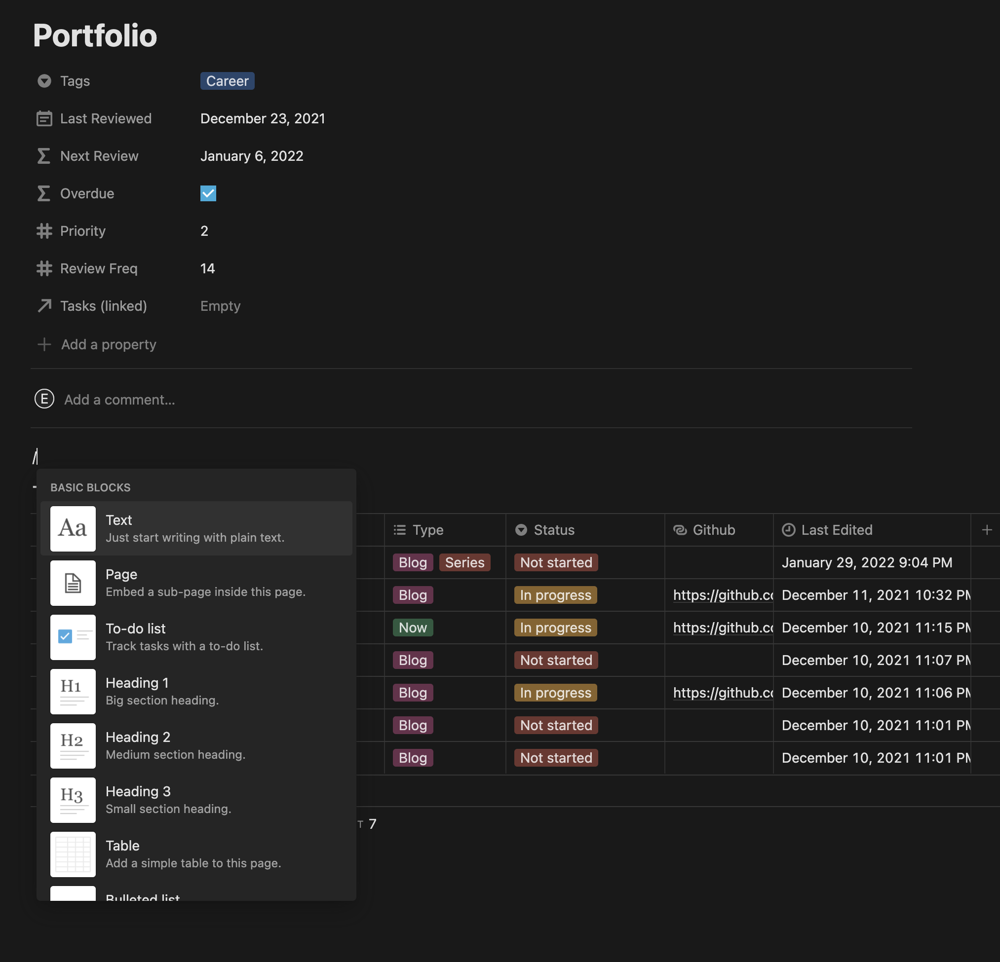
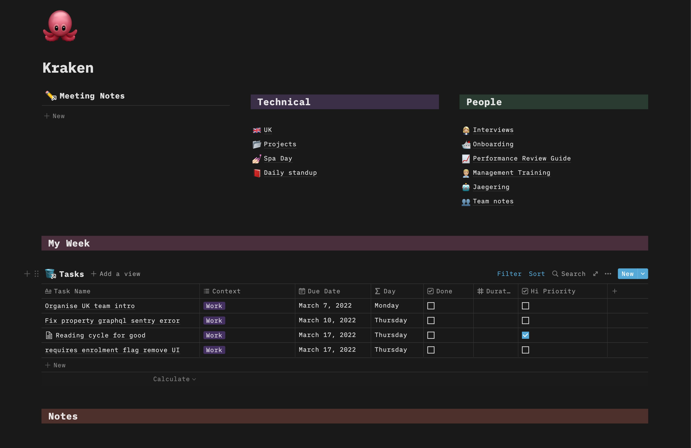

I've been using notion as a note taking app for a while, but had never really dived too much into details of it.  I used a couple of tables (which had already improved my life tenfold) but other than 
that had no idea how powerful a tool it could be. One night I sat down to improve my workflow and 
discovered a new way of using Notion.

## It's a beautiful note taking app

Even if you only use it for writing notes, meeting agendas and lists, it's a well-designed take on rich
text editor and each page can have an emoji attached to it. It supports basic markdown syntax, but 
also has a helpful `/` command which opens a list of things you can put on the page. 

Pages can be nested or linked to in other pages, giving you flexibility in structuring your notes.
Within the page you can create columns and even colour the backgrounds of the section, allowing you
to create intricate dashboards. You can drag sections around easily, which can be to the detriment of
the look when done accidentally!.

They've also made some big speed improvements to the app and on android they have excellent widgets
you can add to your home screen to get to your notes quickly.

Pages can have properties as well, with different data types, which allows easy categorisation and searching. This makes each page like a record in a datbase which is exactly where Notion comes into its own.

## Create a mini application

When I was creating tables and boards I noticed they all had this 'database' label on them.
You can add 'views' to the table (see below) which give you a great overview of different types of
work. 

The way I use these 'databases' now is as the name suggests, and I create master tables which I'll 
never even look at. These databases can be relational too, linking to other tables, for example a 
task can be linked to certain projects. then you can create formula columns for more advanced
functionality, which I use to calculate when I should next review a project based on how often I
want to review it.  You can also implement a sort on the table here which can be handy for time 
based tasks

In order to get a meaningful view of your task data, you can add 'linked databases' to any page 
within your workspace. By filtering the results, for example, you can only show tasks that are 
relevant to your work project.

## Dashboards

With the wide range of font and background colours within the app, as well as being able to create
columns, it's easy to create dashboard pages which organise your notes and tasks efficiently. I 
have one for work and one for personal, creating a nice separation in environments.

I really like the templates feature as well, allowing you to easy make new types of items with preset
data. The app even supports notifications on mobile, so when you set due dates on tasks you can have
handy reminders.

## What could it do better?

It would be great to have the ability to set recurring reminders for tasks. The only way to do this
at the moment is to manually copy rows and incremement the dates. Maybe the ability to have a formula
which is able to depend on the value above?

Me and my partner like to share pages with each other, but we have to switch to the other
person's workspace to view them. Although I understand why you wouldn't want to be able to copy over
pages to different workspaces, it'd make my life so much easier to see to be able to move a reference to it into your
own workspace.
